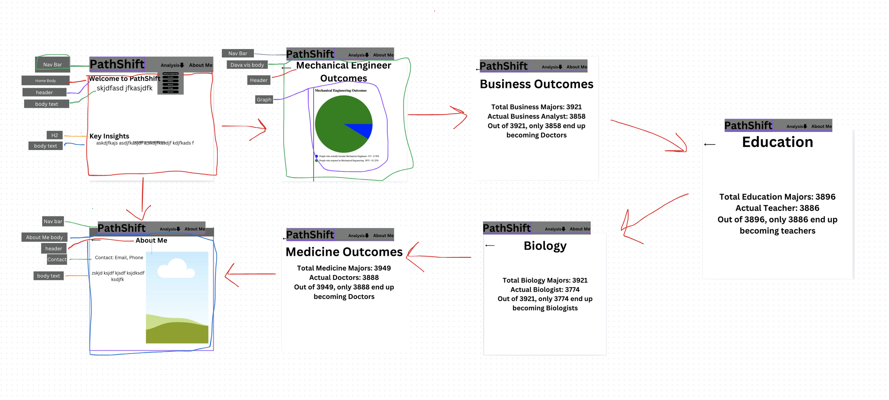
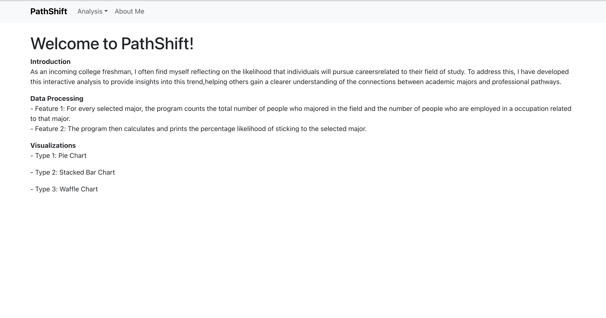
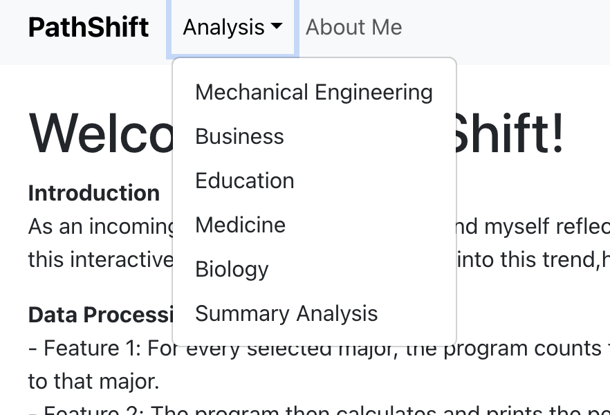

# PathShift: Turn Your Major Into A Mission

## Table of Contents
1. [Overview](#Overview)
1. [Product Spec](#Product-Spec)
1. [Wireframes](#Wireframes)
1. [Schema](#Schema)
1. [Video Walkthrough](#Video-Walkthrough)
2. [UI Progress](#UI-Progress)

### Demo Video

## Overview
Description (Business Thesis)
Rising college students will use PathShift to assess professional alignment with their fields of study.

PathShift helps students and families evaluate the likelihood of a college major translating into a related career, using real-world data analysis and visualizations.

Users can explore occupational trends for different majors to inform smarter educational and professional decisions.

#### Customer Discovery

Customer Segments:

- High school seniors

- First and second-year college students

- Parents/guardians supporting students' academic decisions

#### Problems Indentified
- Lack of data-driven tools to show real-life outcomes of majors.

- Mismatch between expectations and post-graduation realities.

- Parents often hold outdated assumptions about career paths.

#### Interview Questions
* What is your name and current academic status?

* Have you already chosen a major? Why or why not?

* How confident are you that your major will lead to a related job?

* Have you looked at real data about graduates with your major?

* What would help you make a more informed decision?

#### Revenue Model
* Freemium

## Product Spec
- Required Must-Have User Stories
Users can view textual career analysis for 5 different majors.

- Users can interact with buttons to select visualizations.

 - Users can view different visualizations showing major-to-career alignment.

- Users can read an "About Me" page explaining the creator and project.

- Users can access this functionality through a clear navigation UI.

### User Stories (Required and Optional)
- User must select an analysis type before generating a visualization.

- If no selection is made, don't update the page to any analysis and keep user in the homepage. 

### Screen Archetypes

- Home View
 → Summary of purpose, choose a major

- Major Analysis Page
 → Textual summary and different charts/visualizations

- About Me Page
 → Project context and author info

- Navigation Bar
 → Buttons linking to each major’s analysis

### Navigation

**Flow Navigation** (Screen to Screen)

- Home → Navigation Bar → Choose from dropdown whatever analysis your heart desires

- Home → Navigation Bar → About Me

- Navigation Bar → Any View

- Analysis → Home

## Wireframes

## Schema 
### Models

| Property | Type | Description |
| --- | --- | --- |
| FieldOfStudy | Text | User-selected academic major |
| CurrentOccupation | Text | Associated career path|
| CareerMatch | Boolean | Whether the occupation matches the field of study |
| Count | Integer | Number of individuals for that major-occupation pair |

### Networking
- API Endpoint: /api/v1/:major
 → Returns career match data for a selected major

## Video Walkthrough

### Homepage: View the purpose and details of the project

### The Analysis Dropdown that shows all of the analyses

##UI Progress

 - Home layout created with buttons for majors

 - React Router navigation between views

- Different charts implemented using Chart.js, except for waffle chart which I had to manually code.

- PostgreSQL schema loaded with cleaned CSV dataset

- Express API endpoints return filtered analysis
 - Styling improvements and optional features pending
